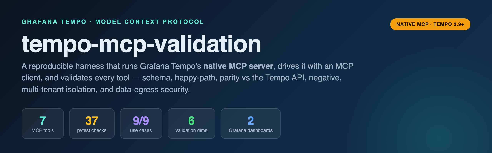
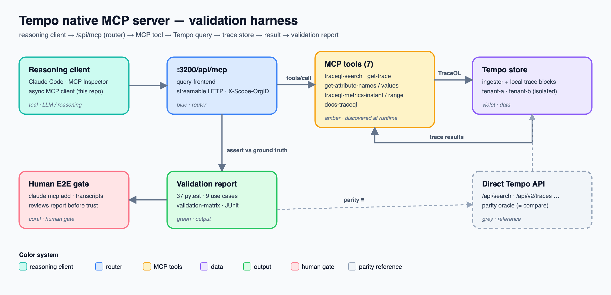
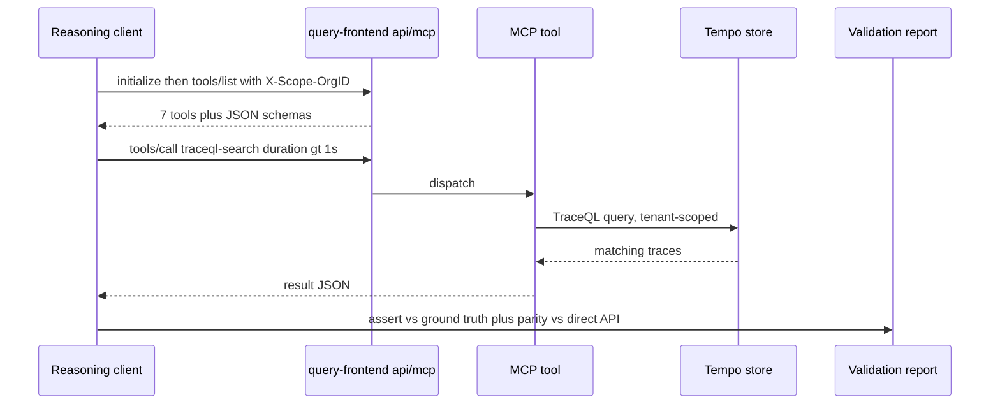

<div align="center">



[](LICENSE)


**A reproducible harness that runs Grafana Tempo's _native_ MCP server, drives it with an MCP client, and proves every tool works — with executable proof over prose.**

</div>

> ⚠️ **Security note.** Enabling the Tempo MCP server *can pass trace data to an LLM or LLM
> provider.* This harness treats that as something to **test**, not a footnote — no real trace
> data is committed, only deterministic seed generators.

---

## 🤔 Why this repo?

Grafana Tempo (OSS **≥ 2.9**) ships an **MCP server built into the query-frontend** — an AI
assistant can query your traces over the Model Context Protocol. That's powerful and risky, and
"it connected" is not the same as "it works correctly." This repo answers, with executable proof:

- Does the server actually speak MCP (`initialize` / `tools/list` / `tools/call`)?
- Does every tool return the **right** data — matching the underlying Tempo HTTP API?
- Is multi-tenancy a real boundary, or can tenant A read tenant B?
- What exactly crosses to the LLM, and is there an anonymous read path?

One command on a fresh clone brings up Tempo, seeds traces, runs the validation, and prints a
pass/fail report.

## ✨ Key features

- 🔌 **Native server only** — the MCP server inside Tempo's query-frontend at `:3200/api/mcp`. No
  third-party/standalone servers.
- 🧭 **Runtime tool discovery** — calls `tools/list`, snapshots tools + schemas to
  `tools_snapshot.json`, and **drift-fails** if a Tempo version changes the set. Never hardcoded.
- ⚖️ **Parity backbone** — every MCP result is compared to the equivalent direct Tempo HTTP API
  result for semantic equivalence.
- 🏠 **Real multi-tenancy** — `X-Scope-OrgID` isolation that genuinely fails if misconfigured.
- 🔐 **Security checks** — flags trace-payload egress to the LLM path; proves there's no anonymous
  read.
- 📊 **Grafana dashboards** — auto-provisioned MCP-server + Tempo-backend monitoring.
- 🧰 **One command, offline** — docker-compose, deterministic seed, no cloud account. Runs with
  `make` **or** a `make`-free Python runner (Windows-friendly).

---

## 🧭 The only system under test

**Grafana Tempo's native MCP server** — built into Tempo's `query-frontend`, not a separate
process.

```yaml
# config/tempo.yaml
query_frontend:
  mcp_server:
    enabled: true       # or flag: --query-frontend.mcp-server.enabled=true
```

- Served over **streamable HTTP** at `http://localhost:3200/api/mcp`.
- Multi-tenancy on → every call carries `X-Scope-OrgID`.
- Register with Claude Code: `claude mcp add --transport=http tempo http://localhost:3200/api/mcp`
- Reference: <https://grafana.com/docs/tempo/latest/api_docs/mcp-server/>

---

## 🏛️ Architecture



**Request flow** (client → server → store → report):



**Observability data flow:**

```
 seed (OTLP) ──▶ Tempo distributor ──▶ ingester / local blocks ──▶ query-frontend ──▶ /api/mcp
                      │                                                                    │
                      └──▶ metrics-generator ──▶ Prometheus ◀── Grafana dashboards ◀───────┘
```

> Color system — **teal** reasoning client · **blue** router (`/api/mcp`) · **amber** MCP tools ·
> **violet** data (Tempo store) · **green** output (report) · **coral** human gate · **grey** parity oracle.

---

## 🚀 Quick start

### Option A — Make (macOS / Linux) · ~2 min

```bash
git clone https://github.com/gpadidala/tempo-mcp-validation && cd tempo-mcp-validation
cp .env.example .env
make install        # uv venv + deps
make all            # up + seed + discover + validate + usecases
```

### Option B — no Make (corporate / Windows) · only Python + Docker

```bash
python tasks.py all          # = make all
./run.sh all                 # macOS/Linux wrapper
.\run.ps1 all                # Windows PowerShell
```

See **[docs/RUNNING.md](docs/RUNNING.md)** for every option, including raw commands.

### Service URLs (once up)

| Service | URL | Notes |
|---------|-----|-------|
| Tempo MCP | <http://localhost:3200/api/mcp> | streamable HTTP; needs `X-Scope-OrgID` |
| Tempo API | <http://localhost:3200> | direct HTTP API (parity oracle) |
| Grafana | <http://localhost:3000> | anon admin → **Dashboards → Tempo MCP** |
| Prometheus | <http://localhost:9090> | metrics-generator backend |
| MCP Inspector | <http://localhost:6274> | `npx @modelcontextprotocol/inspector` |

---

## 📸 Screenshots

A full click-through is in **[docs/e2e-walkthrough.md](docs/e2e-walkthrough.md)** — all captured
live with Playwright via [`scripts/capture_e2e.py`](scripts/capture_e2e.py).

### Connect the MCP Inspector → list the 7 tools
Transport **Streamable HTTP**, URL `http://localhost:3200/api/mcp`, header `X-Scope-OrgID: tenant-a`.

[](docs/screenshots/01_connected_tools.png)

### Find slow requests — `traceql-search { duration > 1s }`
[](docs/screenshots/02_traceql_search_slow.png)

### Fetch a trace by ID — `get-trace`
[](docs/screenshots/03_get_trace.png)

### Multi-tenant isolation (the same query, two tenants)

| `tenant-a` → empty (can't see billing) | `tenant-b` → its 2 billing traces |
|---|---|
| [](docs/screenshots/05a_isolation_tenant_a_empty.png) | [](docs/screenshots/05b_isolation_tenant_b_data.png) |

### The same traces in Grafana Explore (waterfall)
[](docs/screenshots/07_grafana_trace_waterfall.png)

---

## 🔧 The 7 MCP tools (discovered at runtime)

| Tool | Wraps (Tempo HTTP API) | Required args |
|------|------------------------|---------------|
| `traceql-search` | `GET /api/search` | `query` |
| `get-trace` | `GET /api/v2/traces/{id}` | `trace_id` |
| `get-attribute-names` | `GET /api/v2/search/tags` | — |
| `get-attribute-values` | `GET /api/v2/search/tag/{name}/values` | `name` |
| `traceql-metrics-instant` | `GET /api/metrics/query` | `query` |
| `traceql-metrics-range` | `GET /api/metrics/query_range` | `query` |
| `docs-traceql` | (static TraceQL docs) | `name` |

> The harness builds its matrix from the **live** snapshot — a new Tempo version that adds a tool
> shows up as a coverage gap, not a silent pass. Full map:
> [docs/validation-matrix.md](docs/validation-matrix.md).

---

## ✅ Validation

Six dimensions per discovered tool:

| Dimension | Proves |
|-----------|--------|
| **Schema contract** | `tools/list` advertises valid JSON Schema; required args enforced |
| **Happy path** | returns the expected seeded data |
| **Parity** | MCP result ≡ direct Tempo HTTP API result for the same query |
| **Negative / edge** | bad TraceQL, empty/inverted range, missing id → clean error, not a crash |
| **Multi-tenancy** | `X-Scope-OrgID` honored; A can't read B |
| **Security** | flags trace-payload egress; no anonymous read |

### Results

```
make validate    →  37 passed
make usecases    →  9 passed · 0 failed · 0 skipped
make drift       →  no drift: 7 tool(s) match snapshot
```

| # | Use case | Tool(s) | Result |
|---|----------|---------|--------|
| 1 | Find slow requests (`duration > 1s` in checkout) | `traceql-search` | ✅ |
| 2 | Find errors (`status = error`) | `traceql-search` | ✅ |
| 3 | Fetch a trace by ID (full tree) | `get-trace` | ✅ |
| 4 | Discover tag names + service values | `get-attribute-names`, `get-attribute-values` | ✅ |
| 5 | Service-level filter (`frontend`) | `traceql-search` | ✅ |
| 6 | TraceQL metrics (`rate()`) | `traceql-metrics-instant` | ✅ |
| 7 | Empty result is clean (not an error) | `traceql-search` | ✅ |
| 8 | Tenant isolation (A vs B) | `traceql-search` | ✅ |
| 9 | Bad input → MCP error envelope | `traceql-search` | ✅ |

---

## 📊 Grafana dashboards

Two dashboards **auto-provision** into Grafana (no manual import), built on Tempo's own Prometheus
metrics — including the per-tool counter `tempo_query_frontend_mcp_calls_total{tool=...}`. Details:
**[docs/dashboards.md](docs/dashboards.md)**.

### Tempo MCP Server
Per-tool call rate/totals · `/api/mcp` requests by status & method · p50/p95/p99 latency · error ratio.

[](docs/screenshots/08_dashboard_mcp_server.png)

### Tempo Backend (Query & Ingest)
Per-tenant queries/SLO/bytes · frontend queue · spans received · live traces · discarded spans.

[](docs/screenshots/09_dashboard_backend.png)

---

## 🧪 Try it yourself

**MCP Inspector**

```bash
make up && make seed
npx @modelcontextprotocol/inspector        # → http://localhost:6274
# Transport: Streamable HTTP · URL: http://localhost:3200/api/mcp
# Auth header: X-Scope-OrgID = tenant-a   (toggle it ON)
```

**Claude Code**

```bash
claude mcp add --transport=http tempo http://localhost:3200/api/mcp --header "X-Scope-OrgID: tenant-a"
# then ask: "find traces slower than 1s in checkout"
```

---

## 📁 Project structure

```
tempo-mcp-validation/
├── docker-compose.yml          # Tempo (MCP on) + Prometheus + Grafana
├── Makefile · tasks.py · run.sh · run.ps1   # make + make-free runners
├── config/
│   ├── tempo.yaml              # query_frontend.mcp_server.enabled; multi-tenant; metrics-gen
│   ├── overrides.yaml          # per-tenant (legacy-flat) overrides
│   ├── prometheus.yml
│   └── grafana/                # datasource + dashboard provisioning + dashboard JSON
├── seed/generate_traces.py     # deterministic OTLP traces = ground truth
├── client/
│   ├── mcp_client.py           # async MCP client (streamable HTTP, X-Scope-OrgID)
│   ├── discover.py             # tools/list snapshot + drift detection
│   ├── tempo_api.py            # direct Tempo HTTP client (parity oracle)
│   └── shapes.py               # normalize MCP vs API shapes
├── usecases/                   # catalog + runner → report + matrix
├── tests/                      # pytest: protocol, contract, parity, negative, tenancy, security
├── scripts/capture_e2e.py      # Playwright screenshot capture
├── docs/                       # walkthrough, dashboards, runbook, ADRs, diagrams
└── .github/workflows/validate.yml   # CI: compose → seed → validate → publish JUnit + matrix
```

## 🧱 Tech stack

| Layer | Tech |
|-------|------|
| Tracing store + MCP server | Grafana **Tempo 2.10.7** |
| Metrics / dashboards | **Prometheus 3.5.4** · **Grafana 12.4.4** |
| MCP client | official **`mcp`** Python SDK (streamable HTTP) |
| Harness | Python 3.11 · `httpx` · Pydantic v2 · `structlog` · `pytest` |
| Screenshots | Playwright (Chromium) |
| Packaging / tasks | `uv` · Make / `tasks.py` |

## 🗺️ Roadmap

- [ ] Capture the manual Claude-Code E2E transcript as committed evidence (use case #10)
- [ ] Alerting rules on the MCP dashboards (error-ratio / latency SLO burn)
- [ ] Matrix run across multiple Tempo versions to track tool-set drift over time

## 📜 License

[MIT](LICENSE) © 2026 gpadidala

## 👤 Author

**gpadidala** — observability platform engineering. Built with executable proof over prose.

Reference: [Tempo MCP server docs](https://grafana.com/docs/tempo/latest/api_docs/mcp-server/)
