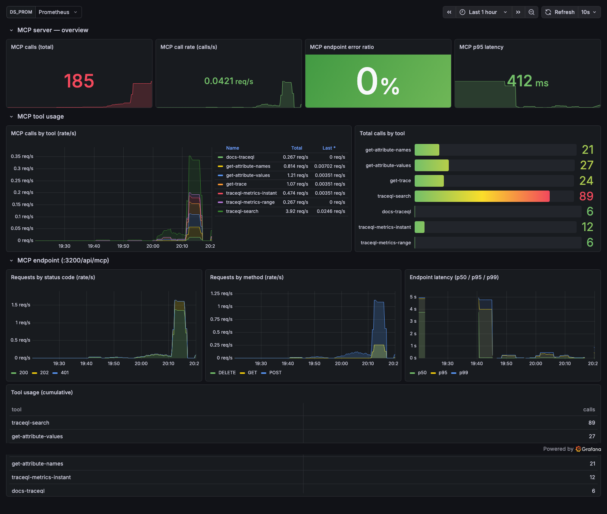
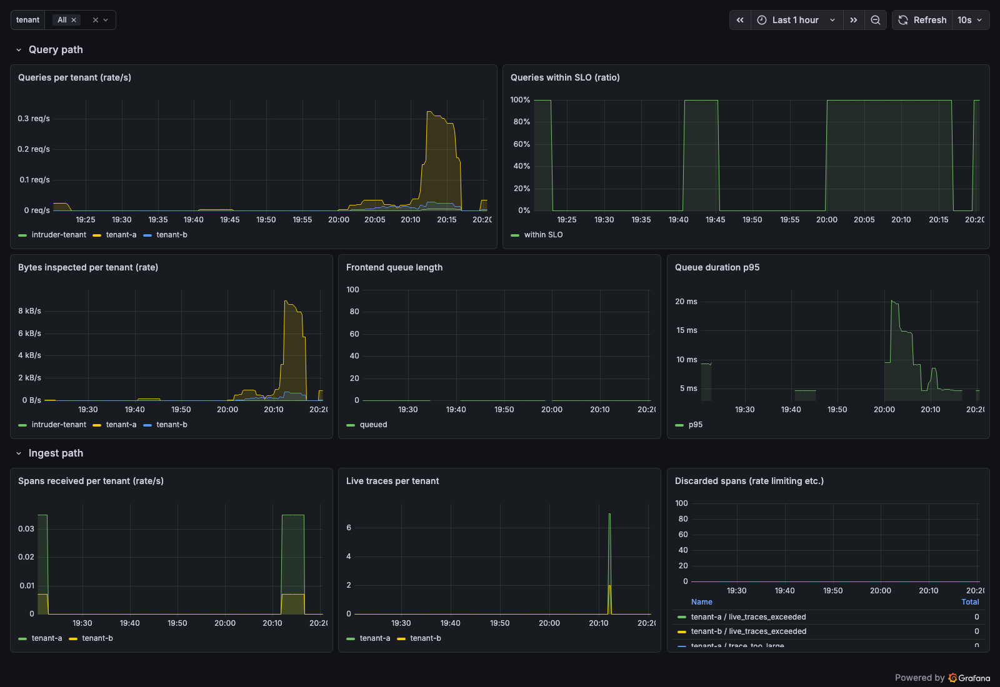

# Grafana dashboards for the Tempo MCP server

Two dashboards ship with the stack and **auto-provision** into Grafana — no manual
import. They monitor the native MCP server and the Tempo backend that serves it,
using Tempo's own Prometheus metrics (scraped by the bundled Prometheus).

Open Grafana at <http://localhost:3000> (anonymous admin) → **Dashboards → Tempo MCP**,
or jump straight to:

- **Tempo MCP Server** — <http://localhost:3000/d/tempo-mcp-server/tempo-mcp-server>
- **Tempo Backend (Query & Ingest)** — <http://localhost:3000/d/tempo-backend/tempo-backend-query-and-ingest>

They are defined as code under
[`config/grafana/dashboards/`](../config/grafana/dashboards) and provisioned via
[`config/grafana/provisioning/dashboards/dashboards.yaml`](../config/grafana/provisioning/dashboards/dashboards.yaml).

## 1. Tempo MCP Server

The headline dashboard for the MCP server itself.



| Panel | Metric | What it tells you |
|-------|--------|-------------------|
| MCP calls (total) | `tempo_query_frontend_mcp_calls_total` | cumulative tool invocations |
| MCP call rate | `rate(...mcp_calls_total[5m])` | live tool-call throughput |
| MCP endpoint error ratio | `tempo_request_duration_seconds{route="api_mcp"}` 4xx/5xx ÷ all | health of `/api/mcp` |
| MCP p95 latency | `histogram_quantile(0.95, ...{route="api_mcp"})` | tail latency |
| MCP calls by tool (rate) | `sum by (tool) (rate(...mcp_calls_total[5m]))` | which tools are used, over time |
| Total calls by tool | `sum by (tool) (...mcp_calls_total)` | tool popularity (bar gauge) |
| Requests by status / method | `...{route="api_mcp"}` by `status_code` / `method` | GET (SSE) vs POST (calls), 200 vs 401 |
| Endpoint latency p50/p95/p99 | `histogram_quantile(...)` | latency distribution |
| Tool usage table | `sum by (tool) (...mcp_calls_total)` | sortable per-tool totals |

The per-tool breakdown comes from Tempo's dedicated
`tempo_query_frontend_mcp_calls_total{tool="..."}` counter — so you see exactly
which MCP tools (`traceql-search`, `get-trace`, …) are being driven.

## 2. Tempo Backend (Query & Ingest)

The supporting backend the MCP server queries. Has a **`tenant`** template variable
(tenant-a / tenant-b) so you can scope or compare tenants.



| Panel | Metric |
|-------|--------|
| Queries per tenant | `tempo_query_frontend_queries_total` |
| Queries within SLO (ratio) | `...queries_within_slo_total ÷ ...queries_total` |
| Bytes inspected per tenant | `tempo_query_frontend_bytes_inspected_total` |
| Frontend queue length | `tempo_query_frontend_queue_length` |
| Queue duration p95 | `tempo_query_frontend_queue_duration_seconds` |
| Spans received per tenant | `tempo_distributor_spans_received_total` |
| Live traces per tenant | `tempo_ingester_live_traces` |
| Discarded spans | `tempo_discarded_spans_total` (rate-limit / too-large reasons) |

## Generating traffic to populate them

Any harness run drives MCP calls and ingest:

```bash
python tasks.py seed usecases     # or: make seed usecases
uv run pytest                     # exercises every tool many times
```

Prometheus scrapes Tempo every 15s, so give the panels ~15–30s to fill in.

## Adding your own panels

Edit the JSON in `config/grafana/dashboards/` (provisioning reloads every 10s), or
edit in the Grafana UI and **Export → Save to file** back into that folder.
Browse Tempo's full metric set at <http://localhost:3200/metrics>.
