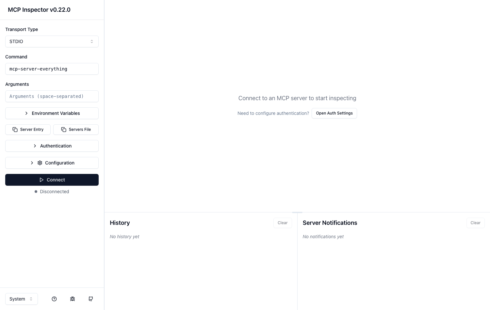
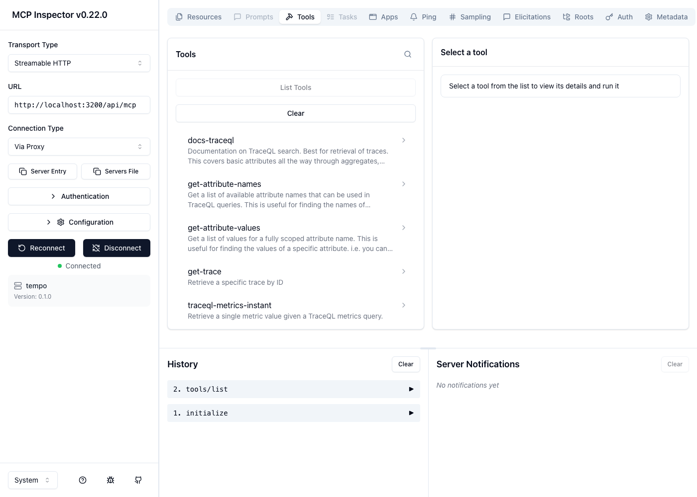
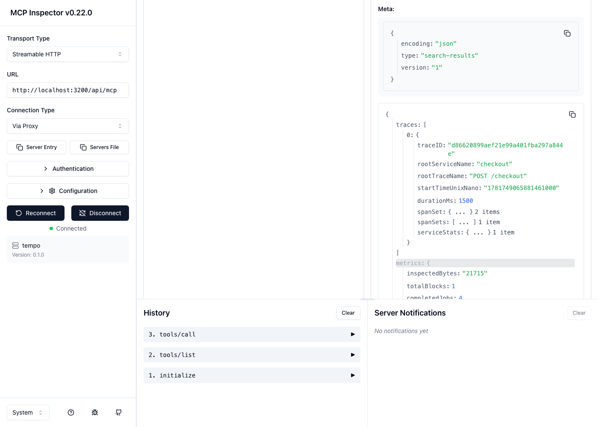
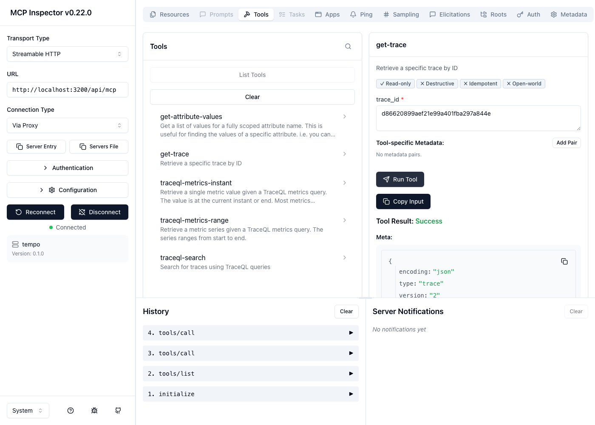
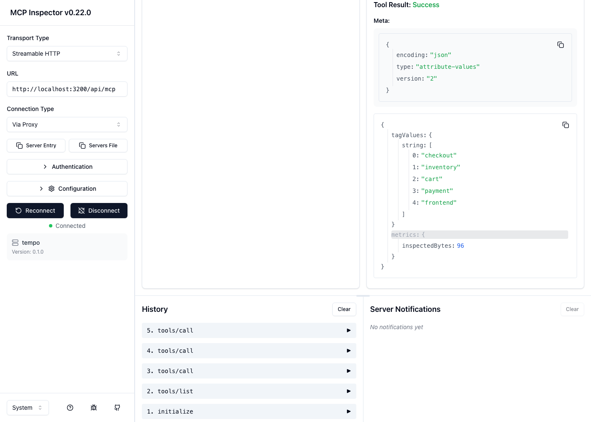
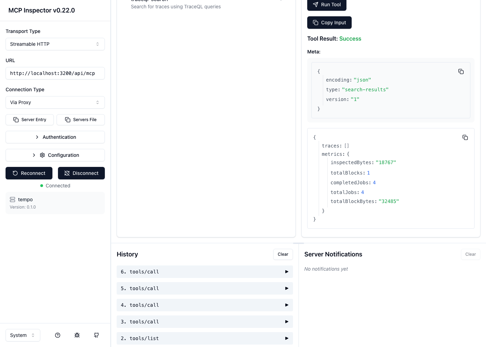
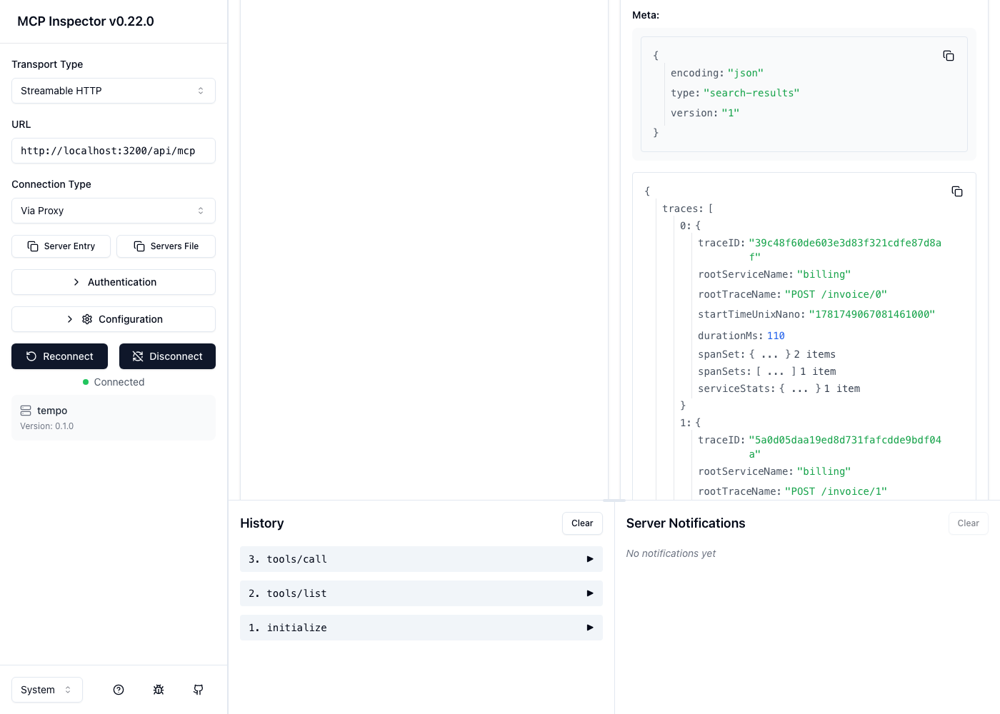
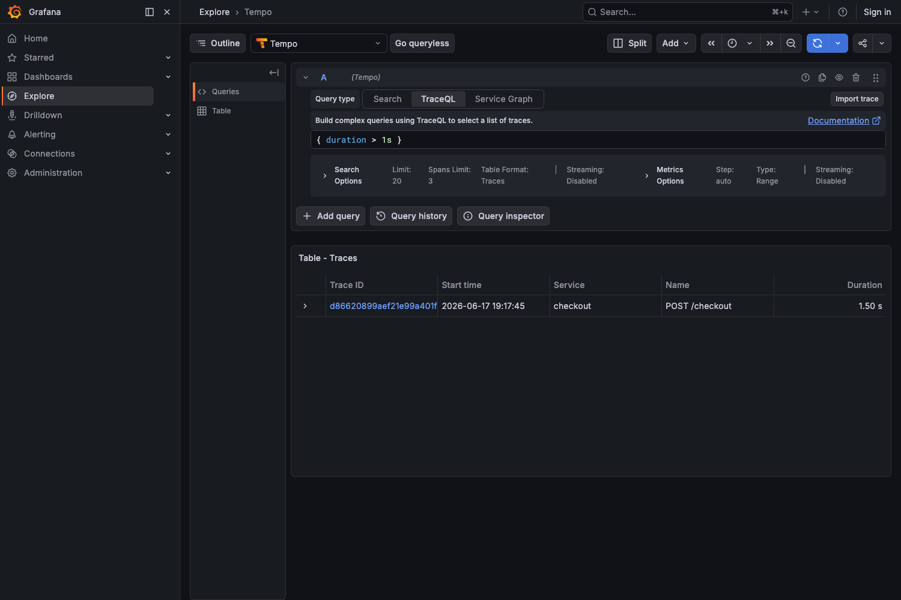
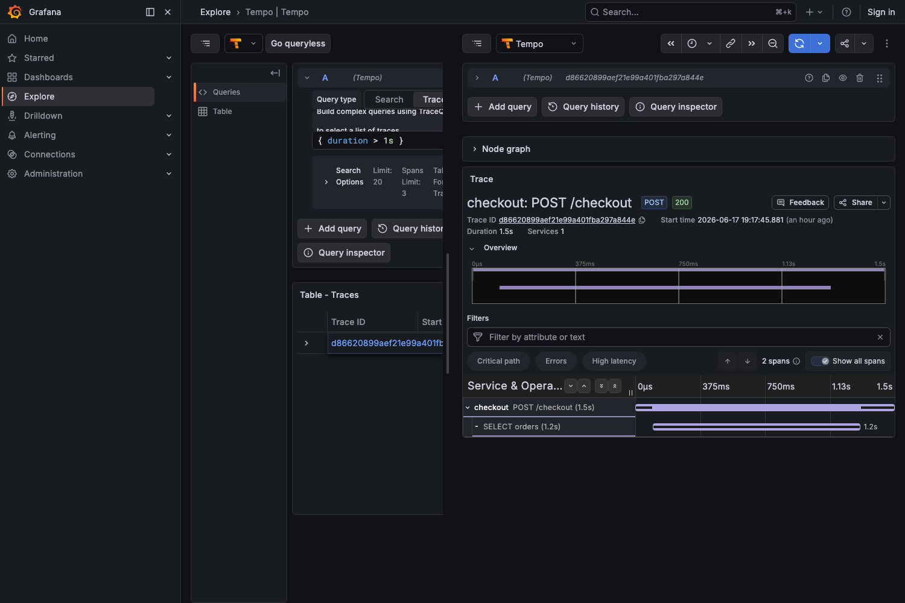

# End-to-end walkthrough

A complete, screenshot-by-screenshot run of the Tempo native MCP server: bring up
the stack, drive the server from the **MCP Inspector** (the MCP client UI), view
the same traces in **Grafana**, and run the automated validation suite.

All screenshots are real captures of the live stack, produced by
[`scripts/capture_e2e.py`](../scripts/capture_e2e.py) (Playwright). To regenerate:

```bash
make up && make seed
DANGEROUSLY_OMIT_AUTH=true npx @modelcontextprotocol/inspector   # in another shell
uv run python scripts/capture_e2e.py
```

---

## 0. Bring up the stack + seed

```bash
cp .env.example .env
make install
make up      # Tempo (MCP on) + Prometheus + Grafana; waits for :3200/ready
make seed    # deterministic traces for tenant-a + tenant-b; blocks until searchable
```

`make seed` prints:

```
seeding traces to http://localhost:4318
  pushed ... for tenant-a -> 200
  pushed ... for tenant-b -> 200
wrote ground-truth fixture -> seed/expected.json
  tenant-a: 7 traces across 5 services
  tenant-b: 2 traces (isolation)
waiting for search indexing to catch up ...
  traces are search-indexed; ready to validate.
```

---

## 1. Open the MCP Inspector and connect

Start the Inspector (`npx @modelcontextprotocol/inspector`) and open
<http://localhost:6274>.



Configure the connection in the left sidebar — **this is the part everyone gets
wrong**, so follow it exactly:

| Field | Value |
|-------|-------|
| **Transport Type** | `Streamable HTTP` (not the default STDIO) |
| **URL** | `http://localhost:3200/api/mcp` |
| **Authentication → Header Name** | `X-Scope-OrgID` |
| **Authentication → Header Value** | `tenant-a` |
| Header **toggle** | **ON** (only enabled headers are sent) |

Tempo runs with multi-tenancy enabled, so the `X-Scope-OrgID` header is required —
without it you connect to an empty tenant and see no data.

Click **Connect**, open the **Tools** tab, and click **List Tools**. The server
reports `tempo v0.1.0` and **7 tools**, discovered at runtime:



---

## 2. Find slow requests — `traceql-search`

Select `traceql-search`, set **query** to `{ duration > 1s }`, click **Run Tool**.
The result is the seeded slow trace: `checkout` / `POST /checkout`, `durationMs: 1500`.



---

## 3. Fetch a trace by ID — `get-trace`

Select `get-trace`, set **trace_id** to the slow trace's ID. The full span tree
comes back intact: the root `POST /checkout` plus its `SELECT orders` child.



---

## 4. Discover what's queryable — `get-attribute-values`

Select `get-attribute-values`, set **name** to `resource.service.name`. The result
lists every seeded service: `cart, checkout, frontend, inventory, payment`.



---

## 5. Prove tenant isolation

Run `traceql-search` with `{ resource.service.name = "billing" }`. `billing` exists
only in **tenant-b**.

**As `tenant-a`** → empty result (`traces: []`). tenant-a cannot see tenant-b's data:



**As `tenant-b`** (reconnect with the header value `tenant-b`) → its 2 billing
traces come back (`POST /invoice/0`, `POST /invoice/1`):



This is exactly what `tests/test_multitenancy.py` asserts — and it genuinely fails
if the tenants are misconfigured.

---

## 6. The same traces in Grafana

Grafana is wired to the Tempo datasource (with the `X-Scope-OrgID: tenant-a` header
pinned). Open <http://localhost:3000> → **Explore → Tempo → TraceQL**, query
`{ duration > 1s }`:



Click the trace to open the span waterfall — `checkout: POST /checkout` (1.5s) with
its `SELECT orders` (1.2s) child:



---

## 7. Run the automated validation

```bash
make validate    # pytest suite
make usecases    # use-case catalog -> reports/usecases.md + validation matrix
```

### pytest — 37 passed

```
tests/test_protocol.py ......... initialize, capabilities, tools/list, errors
tests/test_tools_contract.py ... schema valid + required args enforced
tests/test_traceql_search.py ... slow / errors / service-filter / unique-attr / empty
tests/test_trace_by_id.py ...... full tree / single span / multi-service
tests/test_tag_discovery.py .... names + values cover seeded ground truth
tests/test_traceql_metrics.py .. instant + range (skipped if tool absent)
tests/test_parity.py ........... MCP result == direct Tempo HTTP API
tests/test_negative.py ......... bad TraceQL, inverted window, missing id, recovery
tests/test_multitenancy.py ..... A⟂B isolation, tenant-scoped tag values
tests/test_security.py ......... data-egress flag, no-anonymous-read, foreign tenant
========================= 37 passed =========================
```

> Note: validation runs **right after** `make seed` (as `make all` and CI do).
> `traceql-metrics-instant` (`{} | rate()`) is point-in-time, so it returns 0 if
> the seeded spans have aged out of the rate window — re-seed before validating.

### Use-case acceptance — 9/9

| # | Use case | Tool(s) | Result |
|---|----------|---------|--------|
| 1 | Find slow requests (`duration > 1s` in checkout) | `traceql-search` | ✅ PASS |
| 2 | Find errors (`status = error`) | `traceql-search` | ✅ PASS |
| 3 | Fetch a trace by ID (full tree) | `get-trace` | ✅ PASS |
| 4 | Discover tag names + service values | `get-attribute-names`, `get-attribute-values` | ✅ PASS |
| 5 | Service-level filter (`frontend`) | `traceql-search` | ✅ PASS |
| 6 | TraceQL metrics (`rate()`) | `traceql-metrics-instant` | ✅ PASS |
| 7 | Empty result is clean (not an error) | `traceql-search` | ✅ PASS |
| 8 | Tenant isolation (A vs B) | `traceql-search` | ✅ PASS |
| 9 | Bad input → MCP error envelope | `traceql-search` | ✅ PASS |

Full generated report: `reports/usecases.md`. Per-tool × dimension coverage:
[validation-matrix.md](validation-matrix.md).

---

## What this proves

- The native Tempo MCP server is reachable over streamable HTTP, speaks MCP
  (`initialize` / `tools/list` / `tools/call`), and exposes 7 working tools.
- Every tool returns correct data (vs seeded ground truth) **and** matches the
  direct Tempo HTTP API (parity).
- Multi-tenancy is enforced — `X-Scope-OrgID` is the authorization boundary.
- Trace payloads cross to the MCP/LLM path in plaintext (the documented
  data-egress risk), and there is no anonymous read path.
